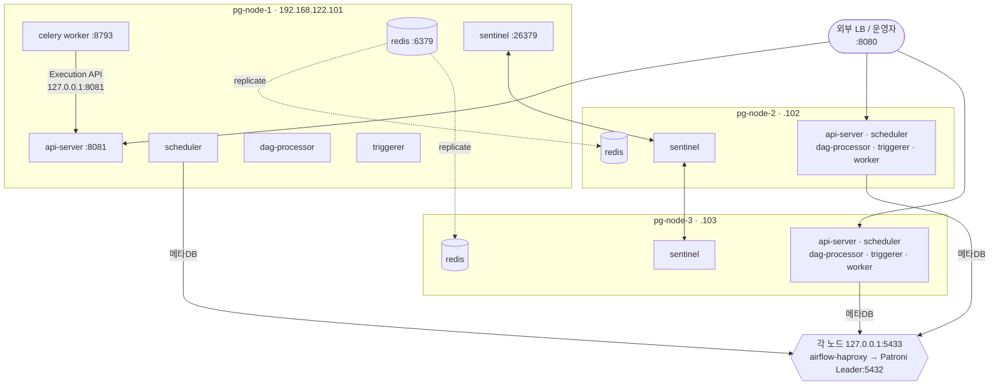
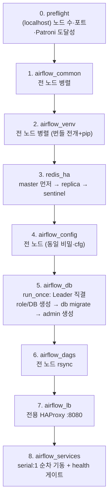

# Airflow 3.3.0 HA (3노드) on Patroni — Ansible 설계

> 작성: 2026-07-31 · 상태: **구현·배포·HA 실검증 완료** (구현 `ansible/`, 결과 §8-A·§9)
> 이 문서는 [`HA-CLUSTER-PLAN.md`](./HA-CLUSTER-PLAN.md)(4노드 PGPool 사이드카 계획)를 **대체**한다.
> PostgreSQL HA가 이미 Patroni로 완성되어 PGPool 설계는 폐기.

## 0. 전제 — 실측으로 확인한 현재 상태

`/root/projects/patroni-postgresql-ha-internal` 로 배포된 3노드 클러스터에 Airflow를 얹는다.

| 항목 | 실측값 |
|------|--------|
| 노드 | `pg-node-1/2/3` = `192.168.122.101/102/103`, RHEL 9.4, **8 vCPU / 16 GB**, `/` 37 GB 여유 |
| Patroni | scope `pg-ha-cluster`, PostgreSQL **16**, 현재 Leader = `pg-node-3` (streaming 정상) |
| DB 진입점 | **VIP `192.168.122.100`** (Keepalived, 현재 pg-node-1) → HAProxy `:5000`(RW→Leader) / `:5001`(RO) |
| HAProxy 백엔드 | `haproxy_backend_target: pgbouncer` → `:6432`, **`pool_mode = transaction`**, `default_pool_size=25` |
| HAProxy stats | `:7000` — **Airflow `:8080`과 충돌 없음** |
| etcd | 각 노드 `:2379` co-location |
| 패키지 | `python3.11.7`·`redis 6.2.7` **이미 설치됨**, 사내 미러 `http://10.0.1.102/rhel-9.4/` + PGDG repo |
| 보안 | SELinux **Enforcing**, firewalld **active** |

> **가정**: Airflow **3.3.0** (세션 첫 요청이 "Airflow 3"). `main` 브랜치에 3경로 검증 완료된 산출물이 있고
> 번들 `dist/airflow-3.3.0-airgap-bundle.tar.gz`(py3.11 wheelhouse)가 타깃 python3.11.7과 일치한다.
> 2.11.0으로 갈 경우의 차이는 §8에 정리.

---

## 1. 토폴로지

3노드 **대칭** 구성. 모든 노드가 Airflow 전 서비스 + Redis를 함께 돌린다.



**핵심**: Airflow는 Patroni Leader가 누구인지 신경 쓰지 않는다. 각 노드의 로컬 haproxy가
Patroni REST `/primary`로 현재 Leader를 판별해 라우팅하므로, 페일오버는 haproxy가 흡수한다.

---

## 2. 핵심 설계 결정

| 항목 | 결정 | 근거 |
|------|------|------|
| 메타DB 엔드포인트 | **각 노드 `127.0.0.1:5433`** (자체 haproxy → Patroni Leader `:5432` 직결) | Patroni가 이미 해결 → **PGPool 폐기**. pgbouncer 는 userlist 소유권 문제로 **우회**(§8-A) |
| `db migrate` / DB 부트스트랩 | **pgbouncer 우회, Leader `:5432` 직결** + `run_once` | alembic DDL·세션 락이 transaction 풀링과 상성이 나쁨. Leader는 Patroni REST `:8008/primary`로 동적 탐색 |
| SQLAlchemy 풀 | `pool_size=5`, `max_overflow=5`, `pool_pre_ping=True` | pgbouncer 를 우회하므로 풀링은 전적으로 여기 담당. HAProxy `on-marked-down shutdown-sessions` 로 페일오버 시 커넥션이 끊기므로 pre_ping 필수 |
| Executor | **CeleryExecutor** | 3노드 대칭 + 워커 수평 확장 |
| 브로커 HA | **Redis Sentinel** (master 1 + replica 2, **quorum 2**) | Celery는 Redis Cluster 브로커 미지원. 3노드=홀수라 split-brain 안전 |
| `result_backend` | `db+postgresql://…@127.0.0.1:5433/airflow` | 브로커와 분리해 메타DB 재사용 |
| **Execution API URL** | **`http://127.0.0.1:8081/execution/`** | 모든 노드가 api-server를 돌리므로 워커는 **자기 노드**를 호출 → 단일 장애점·네트워크 홉 제거 |
| UI 진입 (VM 내부) | **Airflow 전용 HAProxy 인스턴스** (`:8080` → 3× api-server `:8081`) | 기존 `haproxy.cfg` 는 Patroni role 소유라 덮어써진다 → 설정·유닛·PID·stats 포트를 전부 분리 (§7-A) |
| DAG 배포 | **Ansible `synchronize`(rsync)** | 워커가 로컬에서 DAG 를 파싱하므로 전 노드 동일 배포 필수 (§7-D) |
| 공유 비밀 | Ansible Vault (`fernet` / `api secret_key` / **`JWT secret`** / PG / Redis / admin) | 3.x는 JWT 불일치 시 워커 Execution API 401 (검증에서 실측) |
| 패키지 | wheelhouse 번들(오프라인) + RPM은 사내 미러 | 기존 airgap 자산 재사용 |
| 스케줄러 HA | 3대 동시 기동 | Airflow 3 다중 스케줄러 `SKIP LOCKED` 네이티브 지원 |

---

## 3. Ansible 프로젝트 구조

기존 Patroni 프로젝트의 관례(`ansible.cfg`, `group_vars/all/`, role별 `defaults/tasks/templates/handlers`)를 그대로 따른다.
위치: **`airflow-installation` 저장소의 `ansible/`** (신규 브랜치 `feature/ansible-ha`).

```
ansible/
  ansible.cfg                    # patroni 프로젝트와 동일 관례
  site.yml                       # 지휘서 (§4)
  requirements.yml               # community.postgresql, community.general
  inventory/hosts.yml            # airflow_cluster / redis_sentinel 그룹
  group_vars/
    all/main.yml                 # 전 변수 (기본값 + 주석)
    all/vault.yml                # 공유 비밀 (Vault 암호화)
  roles/
    preflight/                   # 노드 수·포트 충돌·Patroni 도달성·번들 존재 검증
    airflow_common/              # 계정·디렉터리·SELinux·firewalld·OS 패키지
    airflow_venv/                # 번들 전개 + wheelhouse 오프라인 pip 설치
    airflow_db/                  # Leader 탐색 → role/DB 생성 → db migrate (run_once)
    redis_ha/                    # master/replica + sentinel (Sentinel 재작성 안전)
    airflow_config/              # airflow.cfg 템플릿 + secrets env(600)
    airflow_dags/                # DAG rsync (synchronize) + import 오류 확인
    airflow_lb/                  # Airflow 전용 HAProxy (Patroni 설정과 분리)
    airflow_services/            # systemd 5종 + 기동/health 게이트
  playbooks/
    cluster-status.yml           # 상태 점검 (무변경)
    deploy-dags.yml              # DAG 만 재배포
    rolling-restart.yml          # 무중단 순차 재시작
    reset-admin-password.yml     # 관리자 비밀번호를 vault 값으로 재설정
  scripts/gen-vault.sh           # 공유 비밀 1회 생성 + Vault 암호화
dags/                            # 검증용 DAG (배포 원본)
```

### 기존 bash → role 매핑

| 기존 | 신규 role | 비고 |
|------|-----------|------|
| `01-os-packages.sh` | `airflow_common` | PG/redis 설치 분기 제거(이미 있음) |
| `06-selinux.sh` | `airflow_common` | `sefcontext`/`seport` 모듈로 |
| `02-venv-offline.sh` | `airflow_venv` | `unarchive` + `pip --no-index` |
| `03-postgres.sh` | **폐기** | Patroni가 대체 |
| `03b-db-external.sh` | `airflow_db` | `community.postgresql` 모듈로 재작성 |
| `04-redis.sh` | `redis_ha` | sed → `template` + sentinel 추가 |
| `05-airflow-init.sh` | `airflow_config` + `airflow_db` + `airflow_services` | heredoc → Jinja2, migrate 분리 |
| `deploy-cluster.sh` | `site.yml` | sshpass·health 루프 → `serial`/`uri` |

---

## 4. `site.yml` 실행 순서

순서 의존성이 이 설계의 핵심이다. **DB 스키마는 정확히 1대만** 만든다.



- **4단계**는 `run_once: true` + `delegate_to: <inventory 첫 노드>`. Leader IP는 `uri` 모듈로 각 노드 `:8008/primary`를 조회해 200을 반환하는 노드로 결정.
- **6단계**는 `serial: 1` — 한 노드씩 기동/재시작하며 `/api/v2/monitor/health` 200을 확인 후 다음 노드로. 롤링 재시작과 동일 코드 경로.

---

## 5. 변수 모델 (`group_vars/all/main.yml` 발췌)

```yaml
airflow_version: "3.3.0"
airflow_bundle: "../dist/airflow-3.3.0-airgap-bundle.tar.gz"
airflow_home: /opt/airflow
airflow_user: airflow

# --- 메타DB: Patroni 클러스터 (pgbouncer 우회) ---
airflow_db_host: 127.0.0.1            # 각 노드의 로컬 airflow-haproxy
airflow_db_port: 5433                 # PG RW 리스너 → 현재 Patroni Leader:5432
airflow_db_name: airflow
airflow_db_user: airflow
patroni_rest_port: 8008               # Leader 탐색용
patroni_direct_port: 5432             # migrate 전용 직결 포트

# --- Redis Sentinel ---
redis_master_host: pg-node-1          # 초기 master (이후 sentinel이 관리)
redis_sentinel_port: 26379
redis_sentinel_master_name: airflow-redis
redis_sentinel_quorum: 2

# --- 서비스 배치 (대칭) ---
airflow_services: [api-server, scheduler, dag-processor, triggerer, celery-worker]
airflow_api_port: 8080
airflow_worker_log_port: 8793
airflow_execution_api_url: "http://127.0.0.1:8080/execution/"   # 자기 노드

# --- 사이징 (§7-B 근거) ---
airflow_celery_worker_concurrency: 4
airflow_sql_pool_size: 5
airflow_sql_max_overflow: 5
airflow_api_workers: 2
```

비밀은 `vault.yml`: `vault_fernet_key`, `vault_api_secret_key`, `vault_jwt_secret`,
`vault_db_password`, `vault_redis_password`, `vault_admin_password`.

---

## 6. Airflow 설정 요점 (`airflow.cfg` 템플릿)

```ini
[core]
executor = CeleryExecutor
execution_api_server_url = http://127.0.0.1:8080/execution/
auth_manager = airflow.providers.fab.auth_manager.fab_auth_manager.FabAuthManager

[database]
sql_alchemy_pool_size = 5
sql_alchemy_max_overflow = 5
sql_alchemy_pool_pre_ping = True        # HAProxy 페일오버 시 죽은 커넥션 감지

[celery]
# 브로커는 Sentinel 목록 — 세미콜론 구분
broker_url = sentinel://:<pw>@192.168.122.101:26379;sentinel://:<pw>@192.168.122.102:26379;sentinel://:<pw>@192.168.122.103:26379
result_backend = db+postgresql://airflow:<pw>@192.168.122.100:5000/airflow

[celery_broker_transport_options]
master_name = airflow-redis
sentinel_kwargs = {"password": "<pw>"}
```

> 비밀은 cfg 평문이 아니라 `${AIRFLOW_HOME}/airflow-secrets.env`(600)에 `AIRFLOW__SECTION__KEY` 환경변수로 주입
> (기존 설계 유지). 비밀번호 **percent-encoding**은 검증에서 실측된 필수 요건 — 템플릿에서 `urlencode` 필터 적용.

---

## 7. 리스크 / 사전 조치

### A. HAProxy 설정 덮어쓰기 → **전용 인스턴스로 해결 (결정됨)**
`/etc/haproxy/haproxy.cfg`는 **Patroni 프로젝트의 `roles/haproxy` 템플릿이 소유**한다. 여기에 Airflow
프론트엔드를 추가하면 다음 Patroni 플레이북 실행 시 **조용히 사라진다**. 따라서 같은 haproxy 바이너리를
쓰되 **모든 접점을 분리한 별도 인스턴스**로 기동한다.

| | Patroni 쪽 | Airflow 쪽 |
|---|---|---|
| 설정 | `/etc/haproxy/haproxy.cfg` | `/etc/haproxy/airflow.cfg` |
| 유닛 | `haproxy.service` | `airflow-haproxy.service` |
| PID/소켓 | 기본 | `/run/airflow-haproxy.pid` · `.sock` |
| 포트 | 5000 / 5001 / 7000 | **8080 / 7001** |

`airflow_lb` role 은 배포 시 Patroni 의 `haproxy.cfg` 에 `8080` 이 들어가 있지 않은지 **역으로 검증**해
설계가 어긋나면 실패시킨다. VIP 를 잡은 노드의 HAProxy 가 3대 api-server 로 분산하고, api-server 는
LB 와 겹치지 않도록 **8081** 로 내린다.

### B. 자원 경합 — 사이징 재검토 필요
각 노드가 `etcd + PostgreSQL + pgbouncer + HAProxy + keepalived`에 더해
`api-server + scheduler + dag-processor + triggerer + celery worker`를 함께 돌린다.
- `postgresql_tuning_profile`이 아직 **`minimal`(4 GB 기준)** — 16 GB 노드에 과소. `small` 이상 권장(랩 노트에도 동일 지적).
- Celery `worker_concurrency`는 기본 16 → **4로 축소**. 16이면 노드당 최대 16 태스크 프로세스가 PG와 메모리를 다툰다.

### C. pgbouncer 풀 사이즈 (⚠ 실무 병목)
`default_pool_size = 25`는 `(user, db)` 쌍당 서버 커넥션 수다. 3노드 × (scheduler + api-server×2 +
dag-processor + triggerer + worker) × SQLAlchemy 풀을 합치면 **25를 쉽게 넘어 대기 큐가 생긴다**.
→ Patroni 측 `pgbouncer` 설정에 `airflow` DB 전용 풀(`pool_size=50` 수준) 추가 또는 `default_pool_size` 상향 필요.
**이건 Patroni 프로젝트 쪽 변경**이므로 별도 조율 대상.

### D. DAG 파일 배포 → **Ansible rsync (결정됨)**
검증에서 실측된 필수 요건 — **워커는 태스크 시작 시 로컬에서 DAG를 파싱**한다. 3노드에 동일 배포가 없으면
`Dag not found during start up`으로 3회 재스케줄 후 실패한다.

`airflow_dags` role 이 `ansible.posix.synchronize` 로 저장소 `dags/` → 전 노드 `/opt/airflow/dags/` 를
동기화한다. `delete: true`(완전 동기화), `__pycache__`/`.git` 제외, 배포 후 소유권·SELinux 레이블 복구,
마지막에 `dags list-import-errors` 로 파싱 오류를 즉시 노출한다. 서비스 재시작은 필요 없다 —
dag-processor 가 `refresh_interval`(300s) 주기로 다시 읽는다.

`playbooks/deploy-dags.yml` 로 DAG만 독립 배포할 수 있다.

### F. 외부 진입점 — KVM 호스트 프록시 (해결됨, 실측 검증)
VM 3대는 libvirt NAT(`192.168.122.0/24`) 안이라 외부에서 VIP `192.168.122.100`에 직접 갈 수 없다.
KVM 호스트(`10.0.1.50`)에 진입점을 만든다.

**iptables DNAT 이 안 되는 이유** (실측):
- `LIBVIRT_FWI` 체인이 `192.168.122.0/24` 로 향하는 커넥션 중 `RELATED,ESTABLISHED` 만 ACCEPT 하고
  나머지는 REJECT → DNAT 를 걸어도 FORWARD 단계에서 막힌다.
- 호스트에 docker · kube-router · libvirt 가 모두 iptables 를 재작성하고 있어 수동 ACCEPT 규칙이 오래 못 버틴다.

**채택**: `systemd-socket-proxyd`(systemd 내장, 추가 패키지 불필요) 기반 소켓 활성화 프록시.
호스트→VM 트래픽은 FORWARD 가 아니라 로컬 발신이라 위 REJECT 를 타지 않는다.

- 포트: **8088** — 호스트의 `8080` 은 **code-server 가 이미 점유** 중이다.
- `airflow_base_url` 을 `http://10.0.1.50:8088` 로 맞춰야 UI 리다이렉트·링크가 깨지지 않는다.
- 한계: 평문 TCP 프록시라 **클라이언트 IP 가 보존되지 않는다**(Airflow 는 `192.168.122.1` 로 인식).
  접근 로그에 실제 IP 가 필요하면 호스트에 haproxy 를 두고 `X-Forwarded-For` 를 붙일 것.
- 구현: `ansible/playbooks/host-portforward.yml`. **검증 완료** — 임시 리스너로
  `10.0.1.50:8088 → 192.168.122.100:8080` HTTP 200 확인.

### E. 그 외
- **호스트명 resolve**: 로그 fetch가 `hostname:8793`을 사용 → 3노드 `/etc/hosts` 상호 등록 필요(실측 요건).
- **firewalld**: 노드 간 `8080`, `8793`, `6379`, `26379` 개방 필요.
- **SELinux Enforcing**: `/opt/airflow` 레이블 + `8793` 포트 타입. `airflow_common`에서 처리.
- **wheelhouse ↔ 타깃 python 정합**: 타깃 3.11.7, 번들은 py3.11 빌드 → 정합. 단 과거 `async-timeout` 마커 이슈가
  있었으므로 첫 설치 시 `pip check` 게이트를 role에 포함.
- **Redis 초기 master 선정**: `redis_master_host`는 최초 1회만 의미. 이후 sentinel이 관리하므로
  플레이북 재실행이 sentinel 판단을 덮어쓰지 않도록 **이미 sentinel이 알고 있으면 skip**하는 가드 필요.

---

## 8. Airflow 2.11.0으로 갈 경우의 차이

| 항목 | 3.3.0 | 2.11.0 |
|------|-------|--------|
| 서비스 | api-server / scheduler / dag-processor / triggerer / worker | webserver / scheduler / worker (+triggerer) |
| Python | 3.11 (노드에 이미 설치됨) | 3.9 |
| 공유 비밀 | fernet + secret_key + **JWT** | fernet + secret_key |
| 워커→중앙 통신 | Execution API(:8080) | 메타DB 직접 접속 |
| health | `/api/v2/monitor/health` | `/health` |
| 번들 | `dist/airflow-3.3.0-airgap-bundle.tar.gz` (존재) | `dist/airflow-2.11.0-airgap-bundle.tar.gz` (존재, py3.9) |

3.x는 워커가 메타DB 대신 Execution API를 쓰므로 **pgbouncer 풀 압박(§7-C)이 2.x보다 오히려 낮다**.

---

## 8-A. 실기 검증에서 드러난 결함 (전부 수정 완료)

배포·검증 과정에서 실제로 터진 것들. 같은 함정을 반복하지 않기 위해 남긴다.

| 증상 | 원인 | 조치 |
|------|------|------|
| api-server 기동 실패 `SASL authentication failed` | VIP:5000 은 pgbouncer 경유인데 pgbouncer 의 `userlist.txt` 를 Patroni 템플릿이 3명으로 하드코딩해 소유 | **pgbouncer 우회** — 자체 haproxy 에 PG RW 리스너(:5433) 추가 (§7-C 소멸) |
| Sentinel 이 master 를 못 봄 → 페일오버 영원히 안 됨 | `bind` 첫 주소가 **나가는 연결의 소스 주소이자 자기 광고 주소**로 쓰인다. `127.0.0.1` 이 앞이면 원격 연결 전부 실패 + peer 를 `127.0.0.1` 로 광고 → `num-other-sentinels 0` | `bind {node_ip} 127.0.0.1` + `sentinel announce-ip` 명시, 기존 학습분은 `SENTINEL RESET` |
| 복제가 통째로 사라짐(전 노드 독립 master) | ① 복제 부트스트랩 가드가 "Sentinel 이 master 를 알면 skip" 인데 우리가 써 넣은 monitor 설정 때문에 항상 참 ② 런타임 `REPLICAOF` 는 영속되지 않아 재시작에 소실 | 가드를 **"Sentinel 이 말하는 현재 master 로 수렴"** 으로 변경 + `CONFIG REWRITE` 로 영속화 |
| Sentinel 검증이 깨진 상태를 통과시킴 | `get-master-addr-by-name` 은 우리가 쓴 monitor 설정을 되읽을 뿐 | `flags` 에 s_down/o_down 없음 + `num-other-sentinels >= quorum-1` + `num-slaves >= 1` 을 모두 확인 |
| `sentinel.conf` 템플릿이 영원히 미적용 | redis 패키지가 stock `sentinel.conf` 를 이미 설치 → "파일 없을 때만" 가드가 항상 거짓 | "**우리 master 이름이 있는가**" 로 판정 + 정적 설정(bind/announce/requirepass)은 매번 강제 |
| `psycopg2` import 실패 | psycopg2 는 시스템 python3.9 에만 있고 Ansible 은 python3.11 을 선택 | DB 태스크만 `ansible_python_interpreter=/usr/bin/python3` |
| secrets env 를 bash 로 source 하면 오작동 | `BROKER_URL` 의 `;` 를 bash 가 명령 구분자로 해석, `SENTINEL_KWARGS` 의 JSON 따옴표가 벗겨짐 | 값을 **작은따옴표로 감쌈**(systemd·bash 양쪽 안전) |
| DAG 배포 직후 `trigger` 가 `DagNotFound` | dag-processor 의 디렉터리 스캔 주기 300초 | 배포 후 `airflow dags reserialize` 수행 |

### ⚠ 남은 조율 대상 — keepalived 헬스체크 (우리가 만든 회귀)
Patroni 쪽 `check_haproxy.sh` 가 `pidof haproxy` 한 줄이라, 같은 바이너리를 쓰는
`airflow-haproxy` 까지 함께 잡힌다. **Patroni 의 haproxy 가 죽어도 VIP 가 넘어가지 않는다.**
`airflow_lb` role 이 이를 감지해 경고하지만, 실제 수정은 Patroni 프로젝트에서 해야 한다
(`kill -0 "$(cat /run/haproxy.pid)"` 또는 `:5000` 리스닝 확인처럼 인스턴스 특정 방식으로).

---

## 9. 구현 상태 / 다음 단계

**구현 완료** — `ansible/` (브랜치 `feature/ansible-ha`). 사용법은 [`ansible/README.md`](./ansible/README.md).
`--syntax-check` 통과, **preflight(0단계)를 실제 3노드에 실행해 전 항목 통과** 확인
(정족수·vault·번들·python3.11·Patroni REST·포트 충돌 없음).

**전체 배포 및 HA 실검증 완료** (2026-07-31, 3노드 실기):
health 4/4 healthy × 3노드 · admin 로그인 · 워커 분산(4/4/4) ·
Patroni switchover 중 24/24 success · Redis master 페일오버 후 24/24 success ·
노드 1대 정지 상태 24/24 success. 상세 표는 `ansible/README.md`.

남은 작업:

1. **keepalived 헬스체크 수정** (§8-A 하단) — Patroni 프로젝트 쪽. 우선순위 높음.
2. §7-B(tuning profile `minimal` → `small` 이상) — Patroni 프로젝트 쪽.
3. flower(:5555) 등 미사용 경로, `RPM_SOURCE=bundle` 완전 오프라인 경로 검증.
4. 운영 전 `admin/admin` 비밀번호 교체 (`playbooks/reset-admin-password.yml`).
