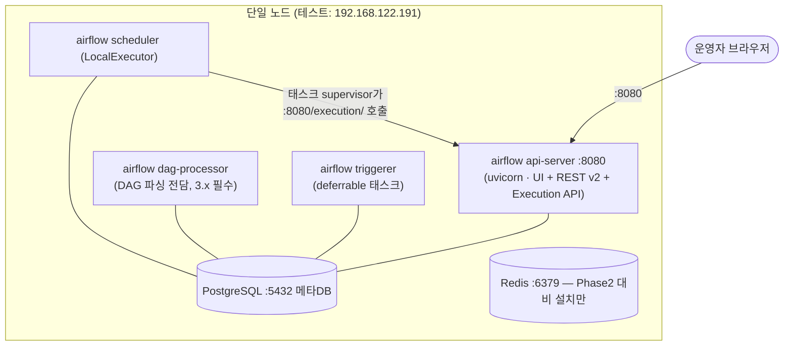
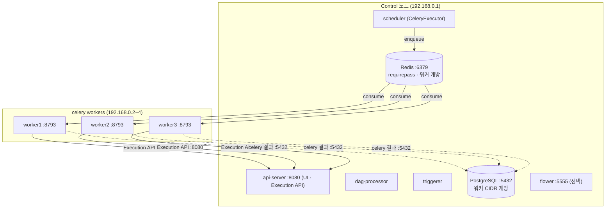

# Apache Airflow 3.3.0 Airgap 설치 설계서

> 대상: RHEL 9.x airgap / 테스트 검증 노드 192.168.122.191 (RHEL 9.2)
> 최초 작성: 2026-06-26 (Airflow 2.11) · **2026-07-16 Airflow 3.3.0 개편**

---

## 0. 2.11 → 3.3.0 개편 배경과 핵심 변경

| 축 | 2.11 설계 (구) | 3.3.0 설계 (현재) | 이유 |
|---|---|---|---|
| Python | 시스템 python3 (3.9) | **AppStream `python3.11`** RPM | Airflow 3.2부터 Python 3.9 지원 제거(3.10~3.14만 지원) |
| constraints | constraints-3.9.txt | **constraints-3.11.txt** | 위와 동일 |
| 빌드 이미지 | ubi9/python-39 | **ubi9/python-311** | ABI 정합 |
| 서비스 | webserver·scheduler (2개) | **api-server·scheduler·dag-processor·triggerer (4개)** | 3.x 아키텍처: webserver→FastAPI api-server, dag-processor 필수 분리 |
| 인증 | FAB 내장 | `[core] auth_manager` = **FabAuthManager** (`fab` provider) | 3.x 기본 SimpleAuthManager는 운영 사용자 관리에 부적합 |
| 공유 비밀 | fernet + secret | fernet + secret + **JWT secret** (`[api_auth] jwt_secret`) | Execution API/UI 토큰 서명. 전 노드 동일 필수 |
| 태스크→DB | 태스크가 메타DB 직접 접속 | **Task Execution API(:8080/execution/) 경유** | 3.x Task SDK 구조. 워커의 DB 직접 의존 제거 |
| EXTRAS | `…,hdfs,…,password,ldap` | `hdfs`→**`apache-hdfs`**, `password` **삭제**(FAB에 통합), **`fab`,`standard` 추가** | 3.3.0 PyPI extras 실측 검증 |
| health | `/health` | **`/api/v2/monitor/health`** | REST v2 |
| DAG 작성 | `schedule_interval`, SubDAG | `schedule`, TaskGroup (SubDAG 제거) | 3.0 breaking changes |

파이프라인 골격(wheelhouse → package → 단일 번들 → install-all.sh)과
유연 구성 축(`INSTALL_ROOT`/`AIRFLOW_USER`/`DB_MODE`/`ROLE`)은 2.11 설계를 그대로 유지한다.

---

## 1. 확정된 전제 (실측 기반)

### 1.1 테스트 검증 노드 (192.168.122.191) — 실측값 (2026-07-16)
| 항목 | 값 |
|---|---|
| OS | Red Hat Enterprise Linux **9.2** (Plow), x86_64 |
| CPU / MEM | 2 vCPU / 7.5 GiB |
| Disk | `/` 44 GB (31 GB 여유) |
| 시스템 Python | 3.9.16 — **사용 안 함**. AppStream에 `python3.11`(3.11.2) 존재 |
| SELinux | **Enforcing** |
| dnf repo | DVD ISO 로컬 repo(rhel-9.2-baseos/appstream) 구성됨 → **`RPM_SOURCE=system`** 사용 |
| 접속 | ssh `fharenheit`, `sudo su -` 로 root 전환 |

> 운영 airgap 대상은 RHEL 9.4 + 사내 미러(`http://10.0.1.102/rhel-9.4/`) 전제 유지.
> python3.11은 RHEL 9.0+ AppStream 공통 제공이라 9.2/9.4 모두 동일 방식.
> (python3.12는 RHEL 9.4부터라 채택하지 않음 — 9.2 노드 호환 위해 3.11로 통일)

### 1.2 Airflow 3.3.0 요구사항 (공식 문서 확인)
- Python **3.10 ~ 3.14** (`requires_python: >=3.10,!=3.15`)
- 메타DB: PostgreSQL **13~17** / MySQL 8.0. RHEL 9 AppStream 기본 postgresql 모듈(13)로 충족
  (PG13은 2025-11 업스트림 EOL — 운영은 `dnf module enable postgresql:15` 권장, §7.5)
- constraints: `constraints-3.3.0/constraints-3.11.txt` (존재/프로바이더 핀 확인:
  celery 3.21.0 · postgres 6.8.0 · redis 4.5.0 · fab 3.7.1 · ssh 5.0.3 · sftp 5.8.2 ·
  apache-kafka 1.14.0 · apache-hdfs 4.12.1 · samba 4.12.6 · standard 1.15.0)

### 1.3 결정 사항
| 항목 | 선택 |
|---|---|
| Airflow 버전 | **3.3.0** |
| Python 런타임 | **AppStream python3.11** (시스템 python3는 불변) |
| 메타DB / 브로커 | **PostgreSQL + Redis** |
| 인증 | **FabAuthManager** (2.x와 동일한 사용자/역할 모델, `airflow users create` 유지) |
| 빌드머신 | 오케스트레이터(Ubuntu+docker+인터넷)에서 **ubi9/python-311** 컨테이너로 wheel 생성 |

---

## 2. 토폴로지 설계

### Phase 1 — 단일 노드 (LocalExecutor)
모든 컴포넌트를 한 노드에 설치. 3.x는 **4개 서비스**가 기본이며, LocalExecutor여도
태스크 실행이 api-server의 Execution API를 경유하므로 **api-server가 죽으면 태스크도 실패**한다.



### Phase 2 — 1 control + 3 celery worker (확장 시)
**Executor = CeleryExecutor**. 3.x에서 워커의 통신 대상이 달라진 것이 최대 변경점:

| 워커가 바라보는 것 | 2.11 | 3.3.0 |
|---|---|---|
| 브로커(Redis) :6379 | ✔ | ✔ |
| 메타DB :5432 | ✔ (태스크가 직접 ORM 접속) | celery **result backend 용도만** |
| control :8080 | ✖ | ✔ **Execution API** (태스크 상태/XCom/Variable/Connection 모두 이 경로) |
| 로그 서빙 | 워커 :8793 개방 | 동일 (워커 :8793) |



**Phase 2 포트 매트릭스 (firewalld):**

| 방향 | 포트 | 용도 |
|---|---|---|
| worker → control | 6379/tcp | Celery 브로커 |
| worker → control | 8080/tcp | **Task Execution API (3.x 신규 필수)** |
| worker → control | 5432/tcp | Celery result backend |
| control(UI) → worker | 8793/tcp | 태스크 로그 조회 |
| 운영자 → control | 8080/tcp | UI/REST |

`OPEN_FIREWALL=true`(control)가 5432/6379/8080을 개방한다(2.11과 동일 — 8080은 원래 개방 대상).

---

## 3. 설치 디렉터리 / 계정 표준 (2.11과 동일)

| 항목 | 값 |
|---|---|
| 서비스 계정 | `airflow` (시스템 계정, nologin) |
| AIRFLOW_HOME | `/opt/airflow` |
| Python venv | `/opt/airflow/venv` (**python3.11** 기반) |
| DAGs / Logs / Plugins | `/opt/airflow/{dags,logs,plugins}` |
| 설정 / 비밀 | `/opt/airflow/airflow.cfg`(640) / `/opt/airflow/airflow-secrets.env`(600) |
| 배포 산출물 적재 | `/opt/airflow-install/` |
| PostgreSQL data | `/var/lib/pgsql/data` (기본 경로 — SELinux 정합 유지) |

`INSTALL_ROOT`/`AIRFLOW_USER`/`CREATE_USER`/`DB_MODE` 파라미터화(§12)는 그대로 유효.

---

## 4. 패키지 인벤토리

### 4.1 OS 패키지
- 런타임: **`python3.11` `python3.11-pip` `python3.11-devel`** gcc gcc-c++ make
- DB: `libpq` `libpq-devel` (+local 모드: `postgresql-server` `postgresql-contrib`)
- 브로커: `redis` / 보조: tar gzip which procps-ng policycoreutils-python-utils
- ldap/kerberos 런타임: `openldap` `cyrus-sasl-lib` `krb5-libs`

`RPM_SOURCE` 3모드: `mirror`(사내 미러 dnf) / `bundle`(번들 로컬 repo, 완전 오프라인) /
**`system`(신규)** — 대상 서버에 이미 구성된 repo(DVD ISO 등)를 그대로 사용, repo 등록 생략.

### 4.2 Python 패키지 (wheelhouse)
- EXTRAS(빌드·설치 동일, 3.3.0 PyPI 실측 검증):
  `celery,postgres,redis,fab,standard,common-sql,ssh,apache-kafka,sftp,ftp,apache-hdfs,samba,pandas,uv,async,ldap`
  - 2.11 대비: `hdfs`→`apache-hdfs` 개명, `password` extra 삭제(비밀번호 인증은 `fab`에 포함),
    `fab`(FabAuthManager+로그인 UI), `standard`(Bash/Python 오퍼레이터 등 기본 프로바이더) 추가
- **extra는 빌드 시점 고정** — 추가 시 wheelhouse 재빌드(`build-wheelhouse-*.sh`와 `install/env.sh` 일치 유지)
- `ldap`(python-ldap)은 sdist → 빌드 컨테이너에 `openldap-devel`/`cyrus-sasl-devel`/`krb5-devel` 필요(반영됨)
- constraints: `constraints-3.3.0/constraints-3.11.txt` / 부트스트랩 `pip setuptools wheel` 동봉

---

## 5~6. 빌드 / 전송 (2.11과 동일 구조)

```bash
# 빌드 (인터넷 빌드머신)
./build/build-wheelhouse-docker.sh    # ubi9/python-311 컨테이너, constraints-3.11
./build/extract-rpms-docker.sh        # (선택) 완전 오프라인용 RPM 추출
./build/package.sh                    # dist/airflow-3.3.0-airgap-bundle.tar.gz

# 전송
scp dist/airflow-3.3.0-airgap-bundle.tar.gz* <user>@<target>:/tmp/
# 대상: sha256 검증 → /opt/airflow-install 에 해제
```

---

## 7. 설치 단계 (install-all.sh가 자동 수행)

00-repo(RPM_SOURCE 분기) → 01-os-packages(**python3.11**) → 06-selinux →
02-venv(**python3.11 -m venv**) → 03/03b-postgres → 04-redis → **05-airflow-init**.

### 7.5 PostgreSQL
RHEL 9 AppStream 기본 모듈은 PG13 (Airflow 3.3 지원 범위 내, 단 업스트림 EOL 2025-11).
운영에서 15를 쓰려면 01 이전에: `dnf module enable -y postgresql:15`. 스크립트는 모듈 버전에 무관.

### 7.7 airflow.cfg (3.3.0 섹션 구조 — 05가 렌더링)
```ini
[core]        executor / auth_manager=FabAuthManager / dags_folder / default_timezone(KST)
              parallelism / max_active_* / execution_api_server_url = http://<CONTROL_IP>:8080/execution/
[database]    풀 설정(sql_alchemy_pool_*) — sql_alchemy_conn 은 비밀이라 env로만
[scheduler]   scheduler_heartbeat_sec / catchup_by_default / max_tis_per_query
[dag_processor]  parsing_processes / min_file_process_interval / refresh_interval
                 / dag_file_processor_timeout   ← 2.x [scheduler]에서 이동
[celery]      worker_concurrency
[logging]     base_log_folder / logging_level
[api]         port / workers / worker_timeout / expose_config / expose_stacktrace / instance_name
              ← 2.x [webserver] 대체. host 기본 0.0.0.0
```
2.x 전용이라 **삭제된 설정**: `[webserver] navbar_color·expose_hostname·warn_deployment_exposure·
worker_class(gunicorn)`, `[api] auth_backends`, UI 타임존(3.x는 사용자별 UI 설정).

### 7.8 비밀 파일 (airflow-secrets.env, 600)
```
AIRFLOW__DATABASE__SQL_ALCHEMY_CONN   # postgresql+psycopg2://…
AIRFLOW__CORE__FERNET_KEY
AIRFLOW__API__SECRET_KEY              # 2.x AIRFLOW__WEBSERVER__SECRET_KEY 대체
AIRFLOW__API_AUTH__JWT_SECRET         # 3.x 신규 — 전 노드 동일 필수
AIRFLOW__CELERY__BROKER_URL
AIRFLOW__CELERY__RESULT_BACKEND
```
키 영속화 우선순위(주입 > 기존 파일 재사용 > 신규생성), cfg 멱등 백업, `run_af()` 주입 방식은 2.11과 동일.

### 7.9 systemd 유닛 (05가 변수 렌더링)
| 유닛 | ExecStart | 기동 대상 |
|---|---|---|
| airflow-api-server | `airflow api-server` | control |
| airflow-scheduler | `airflow scheduler` | control |
| airflow-dag-processor | `airflow dag-processor` | control |
| airflow-triggerer | `airflow triggerer` | control |
| airflow-worker | `airflow celery worker` | worker |
| airflow-flower (선택) | `airflow celery flower` | control(ENABLE_FLOWER=true) |

---

## 8. Phase 2 — CeleryExecutor 설계 (3.x 반영)

역할 모델(`ROLE=control|worker`), cluster.env 공유, 모드 A/B 배포는 2.11 설계 유지. 변경점:

1. **cluster.env에 `AF_JWT_SECRET` 추가** (gen-cluster-keys.sh 반영). fernet/secret/jwt 셋 다
   불일치 시 워커의 Execution API 호출이 401로 실패한다.
2. 워커 설치 검증에서 `db check` 제거 — 워커는 DB 마이그레이션/직접 접속을 전제하지 않음.
3. `AF_EXECUTION_API_URL`(기본 `http://${CONTROL_IP}:8080/execution/`)이 cfg에 렌더링됨.
   워커는 cluster.env의 `CONTROL_IP`로 자동 파생.
4. 방화벽: control 8080이 **UI뿐 아니라 태스크 실행 경로** — 워커 CIDR에서 반드시 도달 가능해야 함.

---

## 9. 검증 체크리스트 (3.3.0)

1. `dnf repolist` 정상 (RPM_SOURCE 모드별).
2. `/opt/airflow/venv/bin/airflow version` → 3.3.0 / `venv/bin/python -V` → 3.11.x
3. `systemctl status airflow-api-server airflow-scheduler airflow-dag-processor airflow-triggerer` 모두 active.
4. `curl http://127.0.0.1:8080/api/v2/monitor/health` → metadatabase/scheduler/dag_processor/triggerer 모두 healthy.
5. 브라우저 `http://<server>:8080` FAB 로그인(admin).
6. 테스트 DAG 트리거 → 태스크 SUCCESS (Execution API 경유 실행 확인).
7. (Phase2) 워커 노드 `systemctl is-active airflow-worker` + control flower/`celery inspect ping`.

---

## 10. 산출물 구조 — 2.11과 동일 (README §6 참조)

## 11. 리스크 / 확인 필요
- **RHEL 9.2 vs 9.4**: 테스트 노드(9.2)와 운영 미러(9.4)의 python3.11 마이너 버전 차이는 ABI 호환(3.11.x).
  wheelhouse는 cp311 태그라 양쪽 동일 사용 가능.
- **PG13 EOL**: 운영 전 `postgresql:15` 모듈 전환 권장(§7.5). Airflow 3.3은 13~17 모두 지원.
- **DAG 마이그레이션**: 2.x DAG 코드는 `schedule_interval`/`SubDagOperator`/`airflow.operators.*` 경로가
  3.x에서 제거/이동됨. 기존 DAG 이관 시 `airflow.providers.standard.*` 경로와 `schedule` 인자로 수정 필요.
- **리소스**: 2vCPU/7.5GB 테스트 노드에서 4서비스+PG+Redis 동시 가동 → api workers=2,
  parsing_processes=2 기본으로 하향(env.sh). 운영 규모에선 상향.

---

## 12. 유연한 구성 — 설치경로 / 실행계정 / DB 외부화

(2.11 설계 §12 그대로 유효 — `INSTALL_ROOT`, `AIRFLOW_USER`/`CREATE_USER`,
`DB_MODE=local|external`+`03b-db-external.sh`, SELinux equivalence `semanage fcontext -e /opt`.
상세는 git 히스토리의 2.11 설계서 참조.)

```bash
# 예) /app 경로 + 기존계정 svc_airflow + 외부 관리형 PostgreSQL(SSL)
export INSTALL_ROOT=/app
export AIRFLOW_USER=svc_airflow AIRFLOW_GROUP=svc_airflow CREATE_USER=false
export DB_MODE=external PG_HOST=pg.db.internal PG_SSLMODE=require PG_PASSWORD='***'
```

---

## 13. AS-BUILT (2026-07-16, 192.168.122.191 단일노드 Phase 1)

| 항목 | 결과 |
|---|---|
| Airflow | **3.3.0** (LocalExecutor), venv `/opt/airflow/venv` — **Python 3.11.2** |
| wheelhouse | **209 wheel** (async-timeout 보충 포함), `--no-index` 오프라인 설치 성공 |
| OS 패키지 | `RPM_SOURCE=system` (VM 자체 DVD ISO repo) — python3.11/postgresql/redis 등 |
| PostgreSQL | 13.10 (AppStream 기본 모듈), DB/롤 `airflow` |
| Redis | 6.2.7 (127.0.0.1:6379, Phase2 대비) |
| 서비스 | postgresql / redis / **airflow-api-server / airflow-scheduler / airflow-dag-processor / airflow-triggerer** 모두 active |
| health | `/api/v2/monitor/health` → metadatabase·scheduler·triggerer·dag_processor 모두 healthy |
| 인증 | FabAuthManager — `POST /auth/token`(admin) JWT 발급 확인, UI 200 |
| E2E | `smoke_test` DAG(TaskFlow, `airflow.sdk`) 트리거 → 2개 태스크 SUCCESS, XCom 전달·태스크 로그 확인 |
| 방화벽 | firewalld 8080/tcp 개방 (Phase1 표준) |
| 접속 | http://192.168.122.191:8080 (admin / `Airflow#Adm2026`) · DB 비번 `Airflow#Pg2026` (운영 전 교체) |

**설치 중 발견/수정 사항**
1. **패치버전 조건부 의존성**: 빌드 컨테이너(ubi9/python-311 = 3.11.9+)와 대상(RHEL 9.2 = 3.11.2)의
   패치 차이로 redis-py의 `async-timeout>=4.0.3; python_full_version < "3.11.3"` 이 wheelhouse에서 누락
   → 설치 시 ResolutionImpossible. **빌드 스크립트가 async-timeout 을 명시 수집**하도록 수정(재발 방지).
2. DAG 작성은 3.x 스타일(`from airflow.sdk import dag, task`, `schedule=None`) 필요 — 2.x DAG 이관 시 주의.
