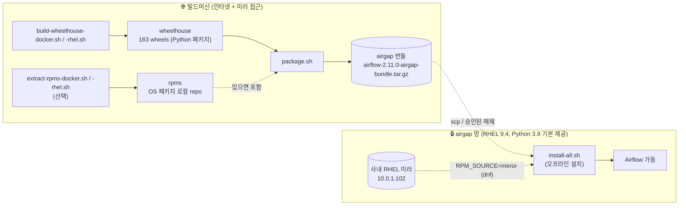
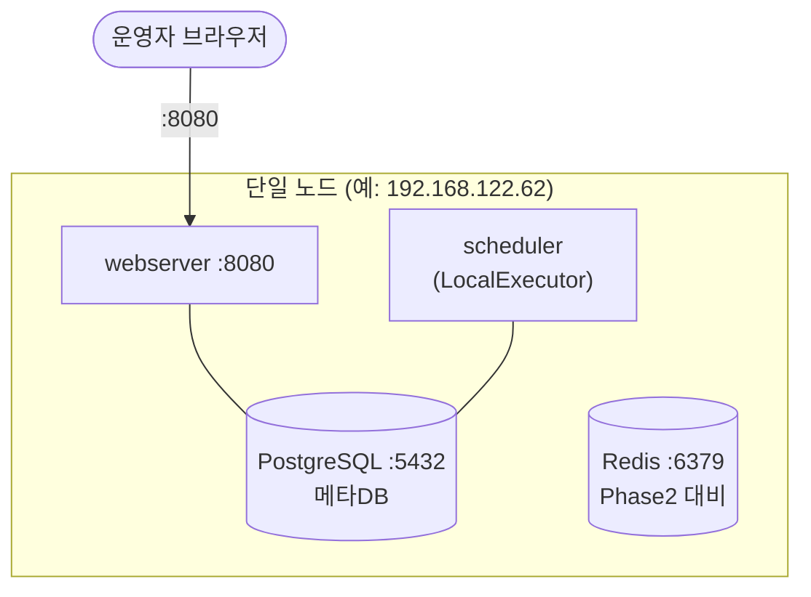
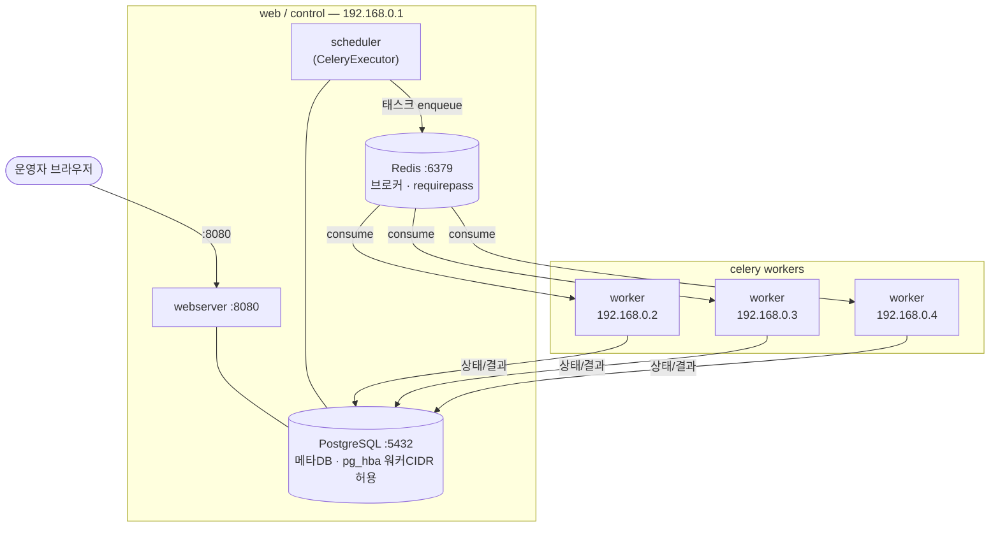
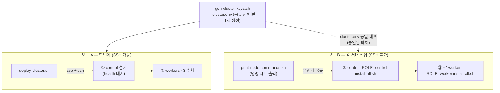

# Apache Airflow Installation for Airgap

RHEL 9.4 폐쇄망(airgap)에 Apache **Airflow 2.11** (Python 3.9, PostgreSQL + Redis)을
오프라인으로 설치하기 위한 빌드/패키징/설치 자동화. 단일 노드(Phase 1)에서 시작해
CeleryExecutor 다중 노드(Phase 2, 1 web + 3 celery)로 확장한다.

자세한 설계는 [`DESIGN.md`](./DESIGN.md) 참고.

---

## 1. 전체 파이프라인 (빌드 ↔ airgap 경계)

인터넷이 되는 빌드머신에서 wheel을 만들어 단일 번들로 묶고, airgap 망으로 옮겨 설치한다.
대상 OS 패키지는 사내 RHEL 미러(`http://10.0.1.102/rhel-9.4/`)에서 `dnf`로 가져온다.



---

## 2. Phase 1 — 단일 노드 (LocalExecutor)

모든 컴포넌트를 한 노드에 설치. Redis는 Phase 2 대비로 설치만 해 둔다.



- 실행계정 `airflow`, `AIRFLOW_HOME=/opt/airflow`, venv `/opt/airflow/venv`
- 비밀(DB비번/fernet/secret)은 `airflow.cfg`가 아닌 **`airflow-secrets.env`(600)** 에 환경변수로 분리

---

## 3. Phase 2 — CeleryExecutor (1 web + 3 celery)

`web`(control) 노드에 webserver+scheduler+메타DB+브로커를 두고, 워커 3대가
control IP로 **원격 접속**한다. 모든 노드는 동일한 `cluster.env`(공유 키/비번)를 사용한다.



> 별도 DB 노드를 두거나 관리형 PostgreSQL을 쓰려면 `DB_MODE=external`로 스왑 (DESIGN §12.4).
> 워커는 `ROLE=worker` 로 설치 시 로컬 DB/Redis를 설치하지 않고 control에 접속만 한다.

---

## 4. 설치 모드 — 한번에 vs 각 서버 직접

SSH 원격 실행 가능 여부에 따라 두 가지 모드를 제공한다. 공통 제약: **control 선행 → 워커**
(메타DB 스키마는 control이 소유, 워커는 `db migrate`를 수행하지 않음).



---

## 5. 빠른 사용법

### 빌드 (인터넷 빌드머신)
```bash
./build/build-wheelhouse-docker.sh   # wheelhouse 생성 (docker, ubi9/python-39)
#   또는  ./build/build-wheelhouse-rhel.sh   # RHEL 9.4 네이티브(docker 불필요)
./build/extract-rpms-docker.sh       # (선택) OS RPM 추출 — 완전 오프라인 설치용 (또는 -rhel.sh)
./build/package.sh                   # dist/airflow-2.11.0-airgap-bundle.tar.gz 생성
```

### Phase 1 설치 (대상 서버)
```bash
mkdir -p /opt/airflow-install
tar xzf airflow-2.11.0-airgap-bundle.tar.gz -C /opt/airflow-install --strip-components=1
cd /opt/airflow-install
PG_PASSWORD=*** AF_ADMIN_PASSWORD=*** ./install/install-all.sh
#   OS 패키지를 번들 RPM(미러 불필요)으로 설치하려면:  RPM_SOURCE=bundle 추가
```

### Phase 2 설치
```bash
# 0) 공유 구성 1회 생성
./install/gen-cluster-keys.sh ./cluster.env 192.168.0.1 192.168.0.0/24

# 모드 A (SSH 가능)
CONTROL_IP=192.168.0.1 WORKER_IPS="192.168.0.2 192.168.0.3 192.168.0.4" \
SSH_USER=root SSH_PASS=*** ./deploy/deploy-cluster.sh

# 모드 B (SSH 불가) — 각 노드 복붙용 명령 출력
CONTROL_IP=192.168.0.1 WORKER_IPS="192.168.0.2 192.168.0.3 192.168.0.4" \
  ./deploy/print-node-commands.sh
```

주요 변수(전체는 `install/env.sh`): `INSTALL_ROOT`(설치경로), `AIRFLOW_USER`/`CREATE_USER`(계정),
`DB_MODE`(local|external), `ROLE`(control|worker), `CONTROL_IP`, `REDIS_PASSWORD`, `OPEN_FIREWALL`.

---

## 6. 저장소 구조
```
build/    build-wheelhouse-{docker,rhel}.sh · extract-rpms-{docker,rhel}.sh   # 빌드/추출
          os-packages.list · package.sh                                      # 목록/패키징
install/  00~06 · install-all.sh · env.sh           # 대상 설치 (오프라인)
          gen-cluster-keys.sh · 99-teardown.sh
deploy/   deploy-cluster.sh · print-node-commands.sh # Phase2 배포 (모드 A/B)
DESIGN.md                                            # 설계서 + AS-BUILT
```
