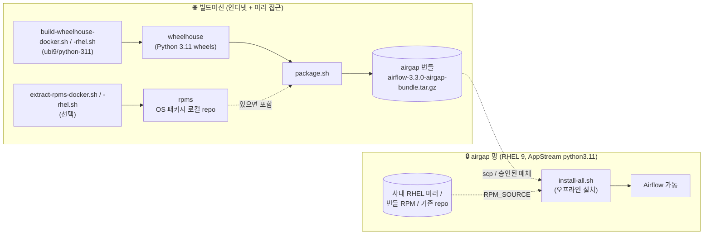
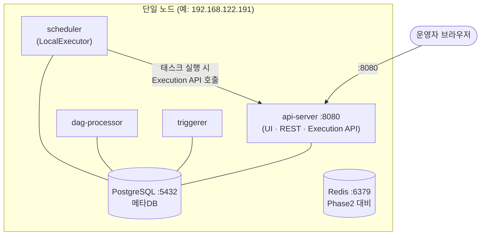
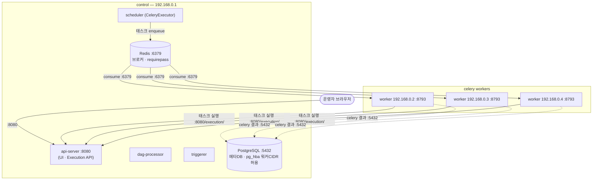
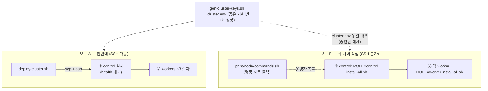

# Apache Airflow Installation for Airgap

RHEL 9 폐쇄망(airgap)에 Apache **Airflow 3.3.0** (Python 3.11, PostgreSQL + Redis)을
오프라인으로 설치하기 위한 빌드/패키징/설치 자동화. 단일 노드(Phase 1)에서 시작해
CeleryExecutor 다중 노드(Phase 2, 1 control + 3 celery)로 확장한다.

> Airflow 3.2부터 Python 3.9 지원이 제거되어 **RHEL 9 AppStream `python3.11`** 을 사용한다
> (시스템 기본 python3(3.9)는 건드리지 않음). 자세한 설계는 [`DESIGN.md`](./DESIGN.md),
> 3경로(Phase 1 / 모드 B / 모드 A) 검증 결과는 [`VERIFICATION.md`](./VERIFICATION.md) 참고.

---

## 1. 전체 파이프라인 (빌드 ↔ airgap 경계)

인터넷이 되는 빌드머신에서 wheel을 만들어 단일 번들로 묶고, airgap 망으로 옮겨 설치한다.
대상 OS 패키지는 사내 RHEL 미러에서 `dnf`로 가져오거나(`RPM_SOURCE=mirror`),
번들 RPM(`bundle`), 대상 서버의 기존 repo(`system`) 중 선택한다.



---

## 2. Phase 1 — 단일 노드 (LocalExecutor)

Airflow 3.x는 컴포넌트가 4개 서비스로 분리된다:
**api-server**(구 webserver, UI + REST + Task Execution API), **scheduler**,
**dag-processor**(3.x부터 필수 독립 프로세스), **triggerer**(deferrable 태스크).
Redis는 Phase 2 대비로 설치만 해 둔다.



- 실행계정 `airflow`, `AIRFLOW_HOME=/opt/airflow`, venv `/opt/airflow/venv` (python3.11)
- 비밀(DB비번/fernet/secret/**jwt**)은 `airflow.cfg`가 아닌 **`airflow-secrets.env`(600)** 에 환경변수로 분리
- 인증은 FAB auth manager(`fab` provider) — 2.x와 동일하게 `airflow users create` 사용 가능

---

## 3. Phase 2 — CeleryExecutor (1 control + 3 celery)

`control` 노드에 api-server+scheduler+dag-processor+triggerer+메타DB+브로커를 두고,
워커 3대가 control IP로 **원격 접속**한다. 모든 노드는 동일한 `cluster.env`(공유 키/비번)를 사용한다.

**Airflow 3.x 통신 구조 변경**: 워커의 태스크는 메타DB에 직접 붙지 않고 control의
**Task Execution API(:8080/execution/)** 를 호출한다. 워커가 control에 필요로 하는 포트:
`6379`(브로커) + `5432`(celery result backend) + `8080`(Execution API). 로그 서빙은 워커 `8793`.



> 별도 DB 노드를 두거나 관리형 PostgreSQL을 쓰려면 `DB_MODE=external`로 스왑.
> 워커는 `ROLE=worker` 로 설치 시 로컬 DB/Redis를 설치하지 않고 control에 접속만 한다.
> 공유 비밀에 fernet/secret 외에 **`AF_JWT_SECRET`** 이 추가됨(전 노드 동일 필수).

**Phase 2 운영 필수 요건** (검증에서 실측 확인, DESIGN §8.6):
1. 각 노드는 **고유 hostname** + control에서 resolve 가능해야 함(로그 fetch가 `hostname:8793` 사용).
2. **DAG 파일은 전 노드 동일 배포**(NFS/GitOps/rsync) — 워커가 태스크 시작 시 로컬에서 파싱.
3. PG/Redis 비밀번호에 특수문자가 있어도 됨 — env.sh가 URL 조립 시 percent-encoding 처리.

---

## 4. 설치 모드 — 한번에 vs 각 서버 직접

SSH 원격 실행 가능 여부에 따라 두 가지 모드를 제공한다. 공통 제약: **control 선행 → 워커**
(메타DB 스키마는 control이 소유, 워커는 `db migrate`를 수행하지 않음).



---

## 5. 빠른 사용법

### 빌드 (인터넷 빌드머신)
```bash
./build/build-wheelhouse-docker.sh   # wheelhouse 생성 (docker, ubi9/python-311)
#   또는  ./build/build-wheelhouse-rhel.sh   # RHEL 9 네이티브(docker 불필요, python3.11)
./build/extract-rpms-docker.sh       # (선택) OS RPM 추출 — 완전 오프라인 설치용 (또는 -rhel.sh)
./build/package.sh                   # dist/airflow-3.3.0-airgap-bundle.tar.gz 생성
```

### Phase 1 설치 (대상 서버)
```bash
mkdir -p /opt/airflow-install
tar xzf airflow-3.3.0-airgap-bundle.tar.gz -C /opt/airflow-install --strip-components=1
cd /opt/airflow-install
PG_PASSWORD=*** AF_ADMIN_PASSWORD=*** ./install/install-all.sh
#   OS 패키지 소스 선택:  RPM_SOURCE=mirror(기본) | bundle(번들 RPM) | system(서버 기존 repo)
```

설치 후 확인: `curl http://127.0.0.1:8080/api/v2/monitor/health` (4개 컴포넌트 healthy),
UI `http://<server>:8080` (admin 로그인).

### Phase 2 설치
```bash
# 0) 공유 구성 1회 생성 (fernet/secret/jwt/비번 포함)
./install/gen-cluster-keys.sh ./cluster.env 192.168.0.1 192.168.0.0/24

# 모드 A (SSH 가능)
CONTROL_IP=192.168.0.1 WORKER_IPS="192.168.0.2 192.168.0.3 192.168.0.4" \
SSH_USER=root SSH_PASS=*** ./deploy/deploy-cluster.sh

# 모드 B (SSH 불가) — 각 노드 복붙용 명령 출력
CONTROL_IP=192.168.0.1 WORKER_IPS="192.168.0.2 192.168.0.3 192.168.0.4" \
  ./deploy/print-node-commands.sh
```

### Redis Sentinel (고가용 브로커, 옵션)

기본 Phase 2 는 브로커(Redis)가 control 1대뿐이라 **브로커가 단일 장애점(SPOF)**이다.
`REDIS_SENTINEL_ENABLED=true` 로 켜면 각 redis 노드에 **master/replica + redis-sentinel**을
구성하고, 브로커 URL 을 `sentinel://` 로 생성한다. master 장애 시 sentinel 이 replica 를
자동 승격(quorum 합의)하고, Celery(kombu)가 sentinel 에게 현재 master 를 물어 재연결한다.

권장 토폴로지: redis+sentinel 을 **홀수 3대 이상**에 배치(예: control + DB 노드들). 결과
백엔드(result_backend)는 그대로 PostgreSQL 을 쓴다.

```bash
# 예) 3대(.101 master, .102/.103 replica)에 sentinel HA 구성 — 각 노드에서:
export REDIS_SENTINEL_ENABLED=true
export REDIS_SENTINEL_HOSTS="192.168.0.1 192.168.0.2 192.168.0.3"   # 전 sentinel(전 노드 동일)
export REDIS_MASTER_HOST=192.168.0.1                                # 부트스트랩 master
export REDIS_ROLE=master     # .1 은 master, .2/.3 은 REDIS_ROLE=replica 로
export REDIS_PASSWORD=***     # requirepass/masterauth (전 노드 동일)
# ROLE=control INSTALL_REDIS=true ./install/install-all.sh
```

> 주의(설계상 함정, 코드에 반영됨):
> - sentinel `bind` 는 **0.0.0.0** 를 쓴다(`127.0.0.1 <ip>` 로 두면 원격 master 접속 실패).
> - `master_name` 은 환경변수로 kombu 에 전달되지 않아, `airflow.cfg` 의
>   `[celery_broker_transport_options]` 섹션에 기록한다(05 가 자동 처리).

주요 변수(전체는 `install/env.sh`): `INSTALL_ROOT`(설치경로), `AIRFLOW_USER`/`CREATE_USER`(계정),
`RPM_SOURCE`(mirror|bundle|system), `DB_MODE`(local|external), `ROLE`(control|worker),
`CONTROL_IP`, `REDIS_PASSWORD`, `AF_JWT_SECRET`, `OPEN_FIREWALL`,
`REDIS_SENTINEL_ENABLED`/`REDIS_SENTINEL_HOSTS`/`REDIS_ROLE`/`REDIS_MASTER_HOST`(Sentinel HA).

> OS 패키지 단계(`01-os-packages.sh`)는 **best-effort** 로 동작한다. 오프라인 wheelhouse 가
> psycopg2-binary 등 빌드 불필요 휠을 담으므로 gcc/`*-devel`/libpq-devel 은 필수가 아니며,
> 대상 노드에 이미 다른 PostgreSQL(예: PGDG 16, libpq 16)이 있어 AppStream libpq-devel 과
> 충돌해도 설치를 중단하지 않는다(PGDG repo 는 이 단계에서 비활성).

---

## 6. 저장소 구조
```
build/    build-wheelhouse-{docker,rhel}.sh · extract-rpms-{docker,rhel}.sh   # 빌드/추출
          os-packages.list · package.sh                                      # 목록/패키징
install/  00~06 · install-all.sh · env.sh           # 대상 설치 (오프라인)
          gen-cluster-keys.sh · 99-teardown.sh
deploy/   deploy-cluster.sh · print-node-commands.sh # Phase2 배포 (모드 A/B)
DESIGN.md                                            # 설계서 + AS-BUILT
```

## 7. Airflow 2.11 → 3.3 주요 변경 요약 (이 저장소 관점)

| 항목 | 2.11 (구) | 3.3.0 (현재) |
|---|---|---|
| Python | 시스템 3.9 | AppStream python3.11 (venv) |
| 서비스 | webserver, scheduler | api-server, scheduler, dag-processor, triggerer |
| UI/REST | Flask(FAB) :8080 | FastAPI api-server :8080 (REST v2: `/api/v2`) |
| 인증 | FAB 내장 | `[core] auth_manager = FabAuthManager` (fab provider) |
| 공유 비밀 | fernet, secret | fernet, secret + **JWT secret** |
| 워커→DB | 직접 접속 | Task Execution API(:8080) 경유, celery 결과만 DB |
| health | `/health` | `/api/v2/monitor/health` |
| extras | `hdfs`, `password` | `apache-hdfs`(개명), `password` 삭제, `fab`/`standard` 추가 |
| DAG 작성 | `schedule_interval`, SubDAG 허용 | 제거됨 — `schedule` 사용, SubDAG→TaskGroup |
