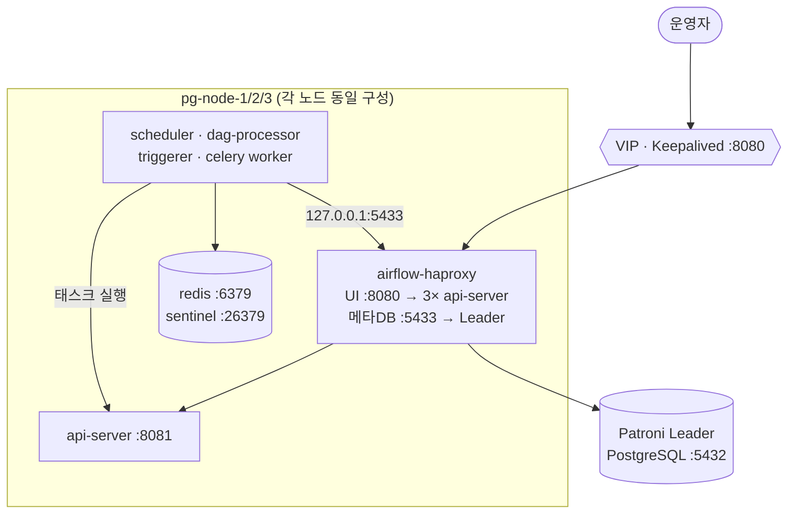

# Airflow 3.x HA (3노드) — Ansible

기존 **Patroni PostgreSQL HA 클러스터** 위에 Airflow 3.x 를 대칭 HA 로 얹는다.
설계 배경과 판단 근거는 [`../AIRFLOW-HA-ANSIBLE-DESIGN.md`](../AIRFLOW-HA-ANSIBLE-DESIGN.md).

## 구성



- **메타DB**: 새로 만들지 않는다. Patroni 클러스터에 `airflow` 롤/DB 만 추가하고,
  각 노드의 로컬 `airflow-haproxy`(`127.0.0.1:5433`)가 Patroni REST `/primary` 로
  현재 Leader 를 찾아 PostgreSQL 에 직결한다. **pgbouncer 는 거치지 않는다** (아래 참조).
- **브로커**: Redis Sentinel (master 1 + replica 2, quorum 2).
- **UI LB**: Patroni 의 `haproxy.cfg` 를 건드리지 않는 **전용 인스턴스**(`airflow-haproxy.service`).
  **기본은 꺼져 있다** — 앞단에 외부 LB 를 두는 구성이 흔하기 때문. `airflow_lb_ui_enabled=true` 로 켠다.
- **워커의 Execution API**: LB 를 거치지 않고 `127.0.0.1:8081` — 자기 노드 api-server 를 호출한다.

> **왜 pgbouncer 를 우회하나**: Patroni 의 HAProxy(:5000)는 pgbouncer 를 거치는데,
> pgbouncer 가 `auth_type=scram-sha-256` + 정적 `userlist.txt` 를 쓰고 그 파일을
> Patroni 프로젝트 템플릿이 **3명(appuser/postgres/pgbouncer_admin)으로 하드코딩**해 소유한다.
> `airflow` 롤을 끼워 넣어도 다음 Patroni 실행 때 지워지고 `SASL authentication failed` 가 난다.
> 우회하면 pgbouncer 의 `default_pool_size(=25)` 경합과 transaction 풀링 위험도 함께 사라진다.

### HAProxy 두 리스너 (독립 토글)

`airflow-haproxy` 인스턴스 하나가 서로 다른 두 가지를 제공하며, 각각 따로 켜고 끈다.

| 변수 | 기본 | 역할 |
|------|------|------|
| `airflow_db_proxy_enabled` | **true** | `127.0.0.1:5433` → 현재 Patroni Leader `:5432` |
| `airflow_lb_ui_enabled` | **false** | `:8080` → 3× api-server `:8081` (+ stats `:7001`) |

```bash
ansible-playbook site.yml -e airflow_lb_ui_enabled=true   # UI LB 켜기
```

⚠ **`airflow_db_proxy_enabled` 를 끄면 Airflow 가 메타DB 에 접속할 방법이 사라진다.**
끄려면 `airflow_db_host`/`airflow_db_port` 를 도달 가능한 다른 엔드포인트로 반드시 함께 바꿀 것
(Patroni 의 VIP:5000 은 pgbouncer 경유라 `airflow` 롤 인증이 실패한다 — 위 참조).
둘 다 끄면 role 이 `airflow-haproxy` 인스턴스를 아예 제거한다.

`airflow_base_url` 은 토글을 따라간다 — UI LB 를 켜면 `VIP:8080`, 끄면 `VIP:8081`
(VIP 를 쥔 노드의 api-server 로 직접). 실제 접속 주소와 다르면 UI 링크가 깨지므로,
앞단에 외부 LB·DNS 를 둔다면 이 값을 그 주소로 바꿀 것.

> **외부 접근**: 이 저장소는 클러스터 내부까지만 책임진다. 운영자 브라우저가 VIP 대역에
> 닿지 않는 환경이라면 앞단에 LB·리버스프록시·DNS 를 별도로 두고, `airflow_base_url` 을
> 그 주소로 바꾼다(실제 접속 주소와 다르면 UI 리다이렉트·링크가 깨진다).

### 포트

| 포트 | 주인 | 비고 |
|------|------|------|
| 5433 | **airflow-haproxy** | 메타DB RW → Patroni Leader (127.0.0.1 전용). `airflow_db_proxy_enabled` **기본 on** |
| 8080 | **airflow-haproxy** | UI 진입점 (VIP 경유). `airflow_lb_ui_enabled` **기본 off** |
| 8081 | airflow api-server | LB 백엔드 + 워커 Execution API |
| 8793 | celery worker | 태스크 로그 서빙 |
| 7001 | airflow-haproxy stats | Patroni 쪽 stats(7000)와 분리. UI LB 를 켤 때만 열린다 |
| 6379 / 26379 | redis / sentinel | 클러스터 대역만 개방 |
| 5000 / 5001 / 7000 | **Patroni 소유** | 건드리지 않음 |

## 사전 준비

```bash
# 1) 컬렉션 (airgap 이면 requirements.yml 주석 참조)
ansible-galaxy collection install -r requirements.yml

# 2) airgap 번들 — 없으면 빌드머신에서 생성
ls ../dist/airflow-3.3.0-airgap-bundle.tar.gz || (cd .. && ./build/build-wheelhouse-docker.sh && ./build/package.sh)

# 3) 공유 비밀 1회 생성 (fernet/secret/JWT/DB/redis/admin)
./scripts/gen-vault.sh          # → group_vars/all/vault.yml (암호화) + .vault_pass
```

> `.vault_pass` 와 `group_vars/all/vault.yml` 은 `.gitignore` 대상이다.
> **`.vault_pass` 를 잃으면 비밀을 복구할 수 없다** — 별도 보관할 것.

## 배포

```bash
ansible all -m ping                        # 연결 확인
ansible-playbook site.yml --tags always    # 사전 검증만 (읽기 전용)
ansible-playbook site.yml                  # 전체 배포
```

부분 실행:

```bash
ansible-playbook site.yml --tags dags      # DAG 만 재배포
ansible-playbook site.yml --tags config    # 설정만 갱신
ansible-playbook site.yml --tags services  # 롤링 재시작 (serial:1 + health 게이트)
ansible-playbook site.yml --limit pg-node-2
```

보조 플레이북:

```bash
ansible-playbook playbooks/cluster-status.yml    # 상태 점검 (무변경)
ansible-playbook playbooks/deploy-dags.yml       # DAG 배포
ansible-playbook playbooks/rolling-restart.yml   # 강제 롤링 재시작
ansible-playbook playbooks/reset-admin-password.yml  # 관리자 비밀번호를 vault 값으로 재설정
```

### teardown (재테스트용)

```bash
# ① Airflow 만 제거 — Patroni 클러스터는 건드리지 않는다
ansible-playbook playbooks/teardown.yml -e teardown_confirm=yes

# ② Airflow + 패키지까지
ansible-playbook playbooks/teardown.yml -e teardown_confirm=yes -e teardown_remove_packages=true

# ③ 랩 완전 초기화 — Patroni/etcd/pgbouncer/keepalived 까지 전부
ansible-playbook playbooks/teardown.yml -e teardown_confirm=yes \
  -e teardown_remove_packages=true -e teardown_include_patroni=true
```

⚠ **되돌릴 수 없다.** 메타DB 스키마·DAG·로그·설정이 사라지므로 `teardown_confirm=yes`
없이는 아무것도 하지 않는다. 사내 미러 repo(`local-*`)와 범용 OS 도구(gcc/tar/rsync 등)는
의도적으로 남긴다 — 전자를 지우면 재설치가 불가능해지고, 후자는 이 스택 전용이 아니다.

> `ansible_python_interpreter` 를 시스템 python3 로 고정한다. 자동탐지는 python3.11 을
> 고르는데 이 플레이북이 그 패키지를 지울 수 있어, 실행 도중 자기 발밑이 무너진다.

## 실행 순서

`site.yml` 은 6단계로 나뉘며 순서가 곧 안전장치다.

| 단계 | 내용 | 실행 범위 |
|------|------|-----------|
| 0 | preflight — 정족수·번들·python3.11·Patroni 도달성·포트 충돌 | 검증만 |
| 1 | 계정/패키지 → venv(오프라인) → Redis+Sentinel → 설정 | 전 노드 병렬 |
| 2 | 메타DB 부트스트랩 (롤/DB 생성 → `db migrate` → admin) | **run_once** |
| 3 | HAProxy (UI :8080 + 메타DB RW :5433) | 전 노드 |
| 4 | DAG rsync | 전 노드 |
| 5 | 서비스 기동 | **serial: 1** + health 게이트 |

**2단계가 `run_once` 인 이유**: 세 노드가 동시에 `db migrate` 를 실행하면 alembic 이 충돌한다.
이 단계는 HAProxy 가 아직 없어도 되도록 Patroni REST(`:8008/primary`)로 Leader 를 직접 찾아
그 노드의 5432 에 붙는다 — 페일오버로 Leader 가 바뀌어도 매 실행 다시 탐색하므로 그대로 동작한다.

**3단계가 DAG 배포보다 먼저인 이유**: 이 HAProxy 가 메타DB 경로(`127.0.0.1:5433`)도 제공한다.
DAG 임포트 검사처럼 DB 에 붙는 태스크가 그 전에 돌면 접속할 곳이 없다.

## DAG 배포

`../dags/` 를 전 노드의 `/opt/airflow/dags/` 로 rsync 한다.

```bash
ansible-playbook playbooks/deploy-dags.yml
ansible-playbook playbooks/deploy-dags.yml -e airflow_dags_src=/path/to/dags/
```

- `airflow_dags_delete: true` — 원본에 없는 파일은 노드에서도 지운다(완전 동기화).
- 배포 후 `dags list-import-errors` 로 파싱 오류를 즉시 확인한다.
- **전 노드 동일 배포는 선택이 아니라 필수다.** 워커는 태스크 시작 시 자기 노드에서 DAG 를
  파싱하므로, 한 노드에만 있으면 다른 노드에 배정된 태스크가 `Dag not found during start up` 으로 실패한다.

## 검증 항목

```bash
curl http://192.168.122.100:8080/api/v2/monitor/health     # 4개 컴포넌트 healthy
ansible-playbook playbooks/cluster-status.yml              # 서비스/브로커/Patroni 요약
```

### HA 실검증 결과 (2026-07-31, 3노드 실기)

| 시나리오 | 결과 |
|---|---|
| 워커 분산 실행 | 12 태스크 → **4/4/4 균등**, 12/12 success |
| **Patroni switchover 중** DAG 실행 | 실행 도중 `pg-node-3 → pg-node-1` 전환. **24/24 success (8/8/8)** — 로컬 haproxy 가 새 Leader 로 자동 재라우팅 |
| **Redis master 강제 종료** | `.101 → .102` 자동 페일오버(약 10~45초). 이후 트리거한 실행 **24/24 success (8/8/8)**. 복귀 노드는 새 master 의 replica 로 자동 재합류 |
| **노드 1대 정지**(pg-node-3 전 서비스) | UI health 200 · 로그인 201 유지, **24/24 success (12/12)** |

재현:

```bash
ansible-playbook playbooks/deploy-dags.yml     # ha_failover_test 배포(24 태스크 × 25초)
airflow dags trigger ha_failover_test          # 실행 중 장애 주입
```

### 비밀번호 교체

`vault_redis_password` / `vault_db_password` 등을 바꾼 뒤에는 `site.yml` 을 다시 돌리면
반영된다. Sentinel 쪽은 정적 설정(bind·announce·requirepass·**auth-pass**)을 매 실행
강제하므로 교체가 누락되지 않는다.

> Sentinel 의 `auth-pass` 가 옛 비밀번호로 남으면 master 접속이 끊기고 **페일오버가
> 조용히 죽는다**(평소엔 아무 증상이 없다). 그래서 최초 템플릿에만 두지 않고 매번 강제한다.
> `sentinel monitor` 보다 뒤에 와야 하므로 삽입 위치도 고정한다 — 앞에 오면
> `No such master with specified name` 으로 Sentinel 기동 자체가 실패한다.

## 알려진 조율 대상 (Patroni 프로젝트 쪽)

- **✅ keepalived 헬스체크 — 해결됨** (`patroni-postgresql-ha` commit `d08ea4a`).
  `check_haproxy.sh` 가 `pidof haproxy` 한 줄이라 같은 바이너리를 쓰는 `airflow-haproxy`
  까지 잡혀, Patroni 의 haproxy 가 죽어도 VIP 가 넘어가지 않았다. 설정파일(`pgrep -f`)과
  RW 포트(`ss`)로 **인스턴스를 특정**하도록 수정했다.
  `airflow_lb` role 이 옛 방식이 남아 있으면 감지해 경고한다.
  > ⚠ PID 파일 방식은 쓰면 안 된다 — SELinux Enforcing 에서 `keepalived_t` 가
  > `haproxy_var_run_t` 를 읽지 못해 **정상 노드까지 전부** 실패로 판정된다.
  > 이 거부는 dontaudit 라 `ausearch` 에도 남지 않고, 모든 노드 priority 가 똑같이
  > 내려가 상대 순위는 유지되므로 겉보기엔 정상처럼 보인다.

- **`postgresql_tuning_profile: minimal`(4 GB 기준)** — 16 GB 노드에는 과소. `small` 이상 권장.
  `patroni-postgresql-ha` 쪽 변수라 별도 조율이 필요하다.
- **`max_connections`** — 현재 200. pgbouncer 를 우회하므로 풀링은 전적으로 Airflow 쪽
  (`airflow_sql_pool_size` + `max_overflow`)이 담당한다. 노드/서비스를 늘리면 함께 확인할 것.
