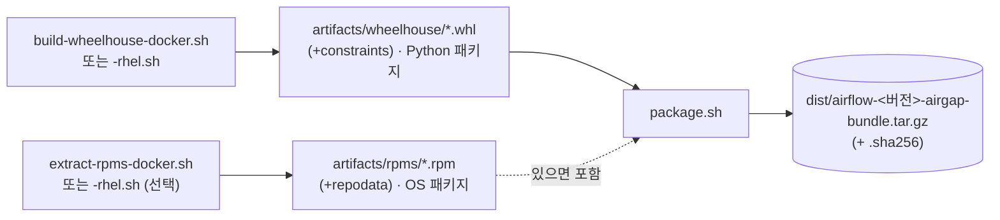

# build/ — wheelhouse 빌드 & airgap 번들 패키징

인터넷이 되는 **빌드머신**에서 실행하는 스크립트. PyPI에서 Airflow 의존성을 모아
RHEL 9 / Python 3.11 호환 **wheel**로 만들고(`build-wheelhouse-*.sh`), 설치 스크립트까지
합쳐 **단일 airgap 번들**로 묶는다(`package.sh`). 산출물을 폐쇄망으로 옮겨 설치한다.



> **Airflow 3.x 는 Python 3.10+ 필수** → RHEL 9 AppStream `python3.11` RPM 사용(시스템 python3(3.9)는 불변).
> **OS 패키지(RPM)** 는 두 가지: ① 설치 시 사내 미러에서 `dnf`(기본), 또는
> ② `extract-rpms-*.sh` 로 yum repo에서 RPM을 추출해 번들에 포함 → target 이 미러 없이 **완전 오프라인** 설치.

> **명명 규칙**: 빌드 방식별로 접미사를 둔다. docker 기반 = `*-docker.sh`, RHEL 네이티브 = `*-rhel.sh`.
> 두 변형은 **동일한 산출물**(`artifacts/wheelhouse` + `constraints-3.11.txt`)을 만들며, 이후 `package.sh`는 공통이다.

---

## 어느 빌드 변형을 쓸까?

| | `build-wheelhouse-docker.sh` | `build-wheelhouse-rhel.sh` |
|---|---|---|
| 실행 환경 | docker 되는 아무 OS(예: Ubuntu) | **RHEL 9.4(또는 Rocky/Alma 9)** 빌드머신 |
| Python | 컨테이너 `ubi9/python-311` | **AppStream python3.11** |
| 격리 | 컨테이너 | `artifacts/.buildvenv`(임시 venv, 종료 시 삭제) |
| ABI 정합 | RHEL9와 동일(ubi9) | 대상과 **동일 OS**라 가장 정합 |
| 적합 상황 | RHEL 빌드머신이 없을 때 | RHEL 9.4 빌드머신이 이미 있을 때(docker 불필요) |

둘 다 대상(RHEL 9 / Py 3.11)에서 그대로 설치되는 wheel을 만든다. **편한 쪽 하나만** 실행하면 된다.

---

## 사전 요구사항 (공통)
- **인터넷 연결** (PyPI / GitHub raw)
- 디스크 여유 ~2GB, x86_64
- 추가:
  - docker 변형: `docker info` 성공. 이미지 `registry.access.redhat.com/ubi9/python-311`(공개, 자동 pull)
  - rhel 변형: RHEL 9 계열 + AppStream `python3.11`. 빌드 도구(`gcc`,`python3.11-devel`,`libpq-devel`)는 스크립트가 `dnf`로 설치 시도(실패해도 대부분 manylinux wheel이라 진행). dnf 설치엔 root/sudo 필요.

---

## 1) `build-wheelhouse-docker.sh` / `build-wheelhouse-rhel.sh`

Airflow + extras 전체를 **바이너리 wheel**로 빌드/수집한다(대상에서 컴파일 0이 목표).

### 사용
```bash
./build/build-wheelhouse-docker.sh     # docker 기반
# 또는
./build/build-wheelhouse-rhel.sh       # RHEL 9.4 네이티브
```

### 환경변수 (두 변형 공통)
| 변수 | 기본값 | 설명 |
|---|---|---|
| `AF_VERSION` | `3.3.0` | Airflow 버전 (constraints도 이 버전으로 매칭) |
| `EXTRAS` | `celery,postgres,redis,fab,standard,common-sql,ssh,apache-kafka,sftp,ftp,apache-hdfs,samba,pandas,uv,async,ldap` | 설치 extras |
| `PY_TAG` | `3.11` (고정) | 대상 Python — 이미지/시스템 Python과 일치해야 함 |

> **extra 변경 시**: `install/env.sh` 의 `EXTRAS` 도 동일하게 맞춘 뒤 wheelhouse 재빌드(설치는 wheelhouse에 있는 wheel만 가능).
> **빌드 헤더 의존성**: 일부 extra는 manylinux wheel이 없어 **빌드 시 devel 헤더** 필요 — `ldap`→`openldap-devel`,`cyrus-sasl-devel`, `samba`/kerberos→`krb5-devel`.
> 스크립트가 컨테이너/빌드머신에 자동 설치한다. 런타임 라이브러리(`openldap`,`cyrus-sasl-lib`,`krb5-libs`)는 `os-packages.list` 에 포함.

### 산출물 (`artifacts/`)
- `artifacts/wheelhouse/*.whl` — 전체 wheel (예: 163개)
- `artifacts/constraints-3.11.txt` — 적용된 공식 constraints
- `artifacts/airflow-<AF_VERSION>-py3.11-airgap.tar.gz` (+`.sha256`) — wheelhouse만 묶은 보조 산출물

### 예시
```bash
AF_VERSION=3.3.0 EXTRAS="celery,postgres,redis,fab,standard" ./build/build-wheelhouse-rhel.sh
```

---

## 1-B) `extract-rpms-docker.sh` / `extract-rpms-rhel.sh` (선택 — 완전 오프라인 OS 패키지)

`build/os-packages.list`(superset) + **전체 의존성**을 사내 RHEL 미러에서 받아
로컬 repo(`artifacts/rpms`, repodata 포함)로 만든다. target 이 설치 시점에 미러에 접근할 수
없는 더 엄격한 airgap에서 사용. (미러 접근 가능하면 생략 가능 — 설치 시 `dnf`로 처리)

### 사용
```bash
./build/extract-rpms-docker.sh    # docker(ubi9) 로 미러에서 추출
# 또는
./build/extract-rpms-rhel.sh      # RHEL 9 빌드머신 네이티브
```

### 환경변수
| 변수 | 기본값 | 설명 |
|---|---|---|
| `RHEL_REPO_BASE` | `http://10.0.1.102/rhel-9.4` | 사내 미러(BaseOS/AppStream 상위) |

### 산출물 (`artifacts/rpms/`)
- `*.rpm` — 패키지 + 전체 의존성(`--resolve --alldeps`, 예: ~266개)
- `repodata/` — `createrepo_c` 로 생성한 로컬 repo 메타데이터

> 추출 머신은 **미러(10.0.1.102)에 접근 가능**해야 함(인터넷과 별개). docker 변형은 컨테이너에서 미러로 `dnf download`.
> 설치 시 `RPM_SOURCE=bundle` 로 이 로컬 repo만 사용(미러 불필요). 기본 `RPM_SOURCE=mirror`.

---

## 2) `package.sh` (공통)

wheelhouse 산출물 + `install/` 스크립트 + `DESIGN.md` + `MANIFEST.txt`를
**서버 업로드용 단일 번들**로 묶는다.

### 사전조건
- 위 빌드 변형 중 하나를 먼저 실행해 `artifacts/wheelhouse`가 있어야 함(없으면 에러 중단).

### 사용
```bash
./build/package.sh
```

### 환경변수
| 변수 | 기본값 | 설명 |
|---|---|---|
| `AIRFLOW_VERSION` | `3.3.0` | 번들 파일명/매니페스트 버전 (※ 빌드의 `AF_VERSION`과 동일하게 맞출 것) |

### 산출물 (`dist/`)
- `dist/airflow-<AIRFLOW_VERSION>-airgap-bundle.tar.gz` (+`.sha256`)
- 번들 내부 레이아웃:
  ```
  airflow-airgap/
    install/              설치 스크립트(00~06, install-all.sh, env.sh, gen-cluster-keys.sh, 99-teardown.sh)
    wheelhouse/           오프라인 wheel
    rpms/                 OS 패키지 로컬 repo (extract-rpms-*.sh 실행 시에만 포함)
    constraints-3.11.txt
    DESIGN.md
    MANIFEST.txt          구성·설치 절차 안내
  ```

---

## 전체 빌드 흐름
```bash
# 빌드머신 (인터넷) — 변형 택1
./build/build-wheelhouse-docker.sh    # 또는 build-wheelhouse-rhel.sh   (Python 패키지)
./build/extract-rpms-docker.sh        # (선택) OS RPM 추출 — 완전 오프라인 설치용
./build/package.sh                    # 단일 번들 생성(rpms 있으면 자동 포함)

# 검증(선택): 깨끗한 컨테이너에서 오프라인 설치 리허설
docker run --rm -v "$PWD/artifacts:/out:ro" registry.access.redhat.com/ubi9/python-311 \
  bash -lc 'python -m venv /tmp/v && /tmp/v/bin/pip install --no-index \
    --find-links /out/wheelhouse -c /out/constraints-3.11.txt \
    "apache-airflow[celery,postgres,redis,fab,standard]==3.3.0" && /tmp/v/bin/airflow version'

# airgap 경계로 전송
scp dist/airflow-3.3.0-airgap-bundle.tar.gz* root@<server>:/opt/
```
이후 대상 서버 설치는 [`../install/`](../install) / [`../README.md`](../README.md) 참고.

---

## 참고 / 주의
- `artifacts/`, `dist/`는 `.gitignore` 대상(번들은 커밋하지 않음).
- 번들은 설치 경로/계정/DB 모드/역할과 **무관** — 한 번 빌드해 모든 구성에 재사용.
- `AF_VERSION`(빌드)과 `AIRFLOW_VERSION`(패키징)을 서로 다르게 주면 파일명이 어긋나니 동일하게.
- rhel 변형은 RHEL 9 계열이 아니거나 python3.11이 없으면 경고/중단한다(ABI 불일치 위험).
